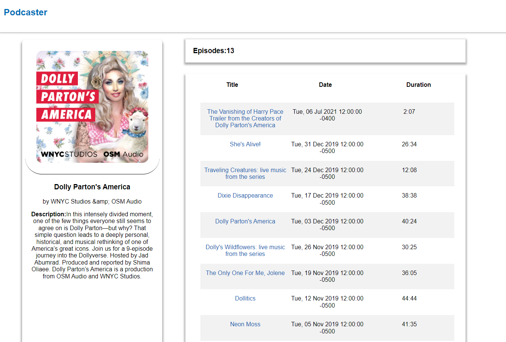

# Podcaster
Proyecto realizado para prueba técnica de Inditex

<p>1. INSTALAR</p>

```
npm install
```

<p>2. EJECUTAR</p>

```
npm start
```

<h3>Tech Stack</h3>
La aplicación ha sido llevada a cabo usando React y SASS.

<h3>Vistas</h3>
<b>Listado de podcast</b>


En la vista "/" tenemos una lista de los 100 podcasts musicales tráidos de iTunes. Nos muestra título, imagen y autor. Dicha lista es almacenada en el localStorage del navegador en caso de haber pasado más de un día depués de su anterior carga.


En esta misma vista tenemos la posibilidad de filtrar los resultados mostrados por medio de un input de texto y conocer el número de programas existentes que coincidan con la búsqueda. Dicho filtro será tanto para los títulos de los podcast como para los autores de estos.


<b>Detalles de podcast</b>


Si clickamos en cualquiera de los nombres de los podcast integrantes de la lista, accederemos al a vista  "/podcast/{podcastId}". En caso de no haber guardado la información sobre dicho podcast previamente en localStorage, tendremos una pantalla de carga hasta contar con los datos.


Además, para cualquier proceso de carga entre vistas, en el header, se muestra un spinner hasta que el proceso haya finalizado.





En la vista detalle del podcast encontramos su título, imagen, autor y una descripción por un lado. A su derecha, se muestra el número de episodios y una tabla de estos con sus respectivos títulos, fechas de publicación y duración.

Clickando en el título de un episodio se irá a la vista detallle del episodio en cuestión. 
"/podcast/{podcastId}/episode/{episodeId}"


<b>Detalle del episodio</b>


En esta vista encontramos de nuevo los detalles correspondientes al podcast a la izquiera y a la derecha, el título, descripción, autor y reproductor de audio del episodio.


